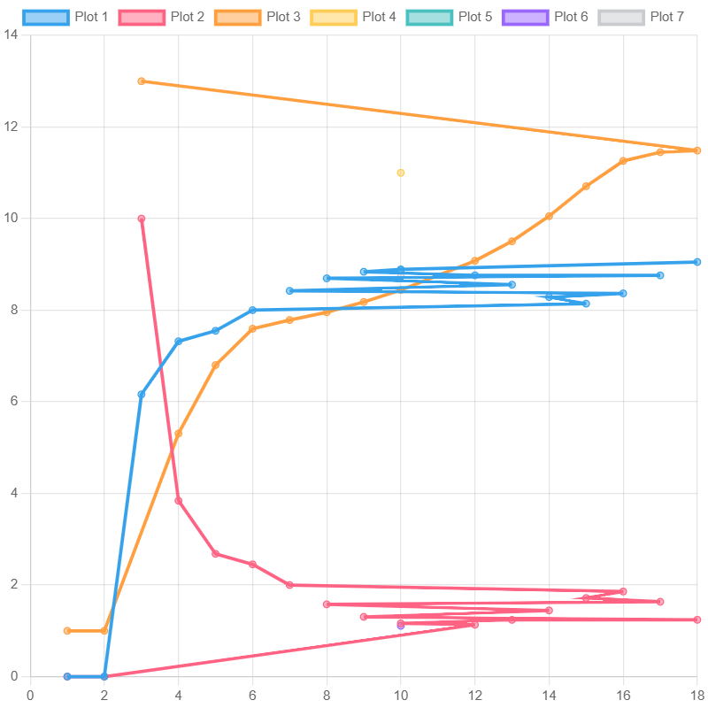

<p align="center"> Министерство образования Республики Беларусь</p>
<p align="center">Учреждение образования</p>
<p align="center">“Брестский Государственный технический университет”</p>
<p align="center">Кафедра ИИТ</p>
<br><br><br><br><br><br><br>
<p align="center">Лабораторная работа №2</p>
<p align="center">По дисциплине “Общая теория интеллектуальных систем”</p>
<p align="center">Тема: “ПИД-регуляторы”</p>
<br><br><br><br><br>
<p align="right">Выполнил:</p>
<p align="right">Студент 2 курса</p>
<p align="right">Группы ИИ-25</p>
<p align="right">Гродзинский А.Д.</p>
<p align="right">Проверил:</p>
<p align="right">Ситковец Я. С.</p>
<br><br><br><br><br>
<p align="center">Брест 2024</p>

<hr>

# Общее задание #
1. Написать отчет по выполненной лабораторной работе №1 в .md формате (readme.md) и с помощью запроса на внесение изменений (**pull request**) разместить его в следующем каталоге: **trunk\ii0xxyy\task_02\doc** (где **xx** - номер группы, **yy** - номер студента, например **ii02302**).
2. Исходный код написанной программы разместить в каталоге: **trunk\ii0xxyy\task_02\src**.

# Задание #
Задание. На C++ реализовать программу, моделирующую рассмотренный выше ПИД-регулятор. В качестве объекта управления использовать математическую модель, полученную в предыдущей работе. В отчете также привести графики для разных заданий температуры объекта, пояснить полученные результаты.


<hr>

# Выполнение задания #

Код программы:
```C++
#include <iostream>
#include <vector>
#include <cmath>
#include <iomanip>
using namespace std;

// Глобальные переменные для коэффициентов и параметров
double coeffA, coeffB, coeffC, coeffD; // Коэффициенты системы
double gain, desiredOutput; // Параметры системы
double reg0, reg1, reg2; // Параметры регулятора

// Функция для симуляции системы
void runSimulation() {
    const double INITIAL_OUTPUT = 2.0;  // Начальное значение выхода
    double controlSignal = 0.0;          // Изначальный управляющий сигнал
    double integral = 0.0; // Переменная для интегральной части
    double previousError = 0.0; // Переменная для хранения предыдущей ошибки
    vector<double> outputs = { INITIAL_OUTPUT };  // Вектор выходных значений
    vector<double> errors = { desiredOutput - INITIAL_OUTPUT };  // Инициализация вектора ошибок

    // Цикл продолжается, пока ошибка больше 0.01
    while (fabs(errors.back()) > 0.01) {
        double currentError = desiredOutput - outputs.back(); // Текущая ошибка
        errors.push_back(currentError);

        // Обновление интегральной части
        integral += currentError;

        // Пропорциональная + интегральная + дифференциальная составляющая
        controlSignal = gain * (currentError + 0.1 * integral + 0.1 * (currentError - previousError));

        // Упрощенные формулы для нового выхода
        double newOutput = coeffA * outputs.back() + coeffB * sin(controlSignal) + coeffC * controlSignal;

        // Обновление выходных данных
        outputs.push_back(newOutput);
        previousError = currentError; // Обновление предыдущей ошибки
    }

    // Вывод результатов симуляции
    cout << fixed << setprecision(4);  // Форматируем вывод с 4 знаками после запятой
    cout << "Step\tOutput\tError\n"; 
    for (size_t i = 0; i < outputs.size(); ++i) { // Итерируем по всем шагам
        cout << i + 1 << "\t" 
             << outputs[i] << "\t" 
             << errors[i] << endl; 
    }
}

int main() {
    // Ввод параметров системы от пользователя
    setlocale(LC_ALL, "RU"); 
    cout << "Введите коэффициенты системы:\n";
    cout << "coeffA: "; cin >> coeffA; 
    cout << "coeffB: "; cin >> coeffB; 
    cout << "coeffC: "; cin >> coeffC; 
    cout << "coeffD: "; cin >> coeffD; 

    cout << "\nВведите параметры системы:\n";
    cout << "gain: "; cin >> gain; 
    cout << "desiredOutput (желаемое значение выхода): "; cin >> desiredOutput; 

    // Расчет параметров регулятора
    reg0 = gain + 5; // Можно сделать их зависящими от gain
    reg1 = -gain / 2; // Изменяем коэффициент для большей сложности
    reg2 = gain * 0.5; // Можно использовать различные значения для упрощения и компоновки

    // Запуск симуляции
    runSimulation();

    return 0; // Выход из программы
}
'''
Вывод:
'''
 Итерация    Выход      Ошибка    Контроль
        1        0           0           1
        2        0           0           1
        3  6.16092          10          13
        4   7.3199     3.83908     5.30689
        5  7.55022      2.6801     6.80095
        6  8.00088     2.44978     7.59588
        7  8.42251     1.99912     7.78563
        8  8.69575     1.57749     7.95464
        9  8.83901     1.30425     8.17916
       10   8.8914     1.16099     8.44137
       11  8.86832      1.1086     8.73495
       12  8.76161     1.13168     9.07768
       13  8.55626     1.23839     9.50436
       14  8.28491     1.44374     10.0531
       15  8.14266     1.71509      10.707
       16  8.36672     1.85734     11.2593
       17  8.76001     1.63328     11.4493
       18  9.05286     1.23999     11.4855
'''
