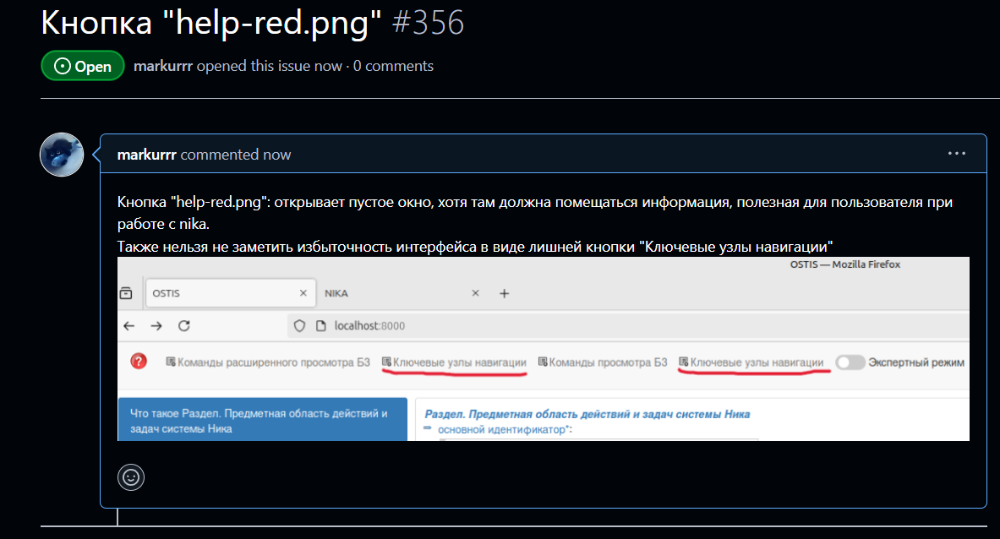

 Министерство образования Республики Беларусь

Учреждение образования

“Брестский Государственный технический университет”

Кафедра ИИТ

       

Лабораторная работа №5

По дисциплине “Общая теория интеллектуальных систем”

Тема: “Работа с проектами”

     

Выполнила:

Студентка 2 курса

Группы ИИ-25

Мархель А. Д.

Проверила:

Ситковец Я. С.

     

Брест 2024

---

# Работа с проектами #

1. Изучить следующие открытые проекты:

    1.1. The [OSTIS](https://github.com/ostis-ai) Technology project;

    1.2. The OSTIS [Applications](https://github.com/ostis-apps);

2. Внести свой вклад в проект (в виде оформления вопросов (issues)):
- предложить исправления в ошибках в документации (синтаксические, орфографические и т.п.);
- предложить исправления в исходном коде;
- предложить новую функциональность.

3. Написать отчет по выполненной работе в .md формате (readme.md) и с помощью pull request разместить его в следующем каталоге: trunk\ii0xxyy\task_05\doc.

---

# Выполнение задания #

# Предложила исправления ошибок и добавление недостающей функциональности:

